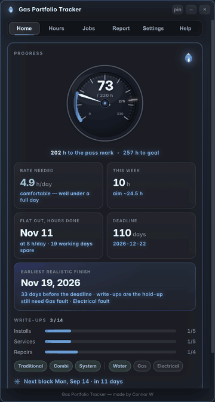
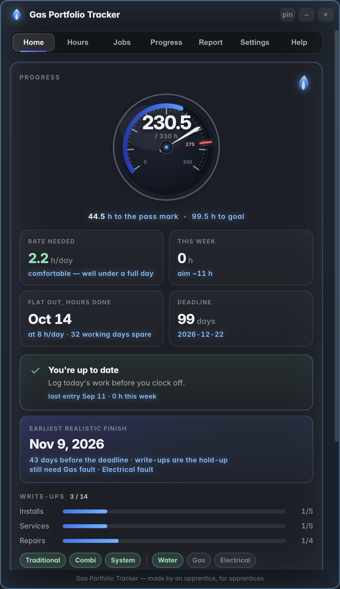
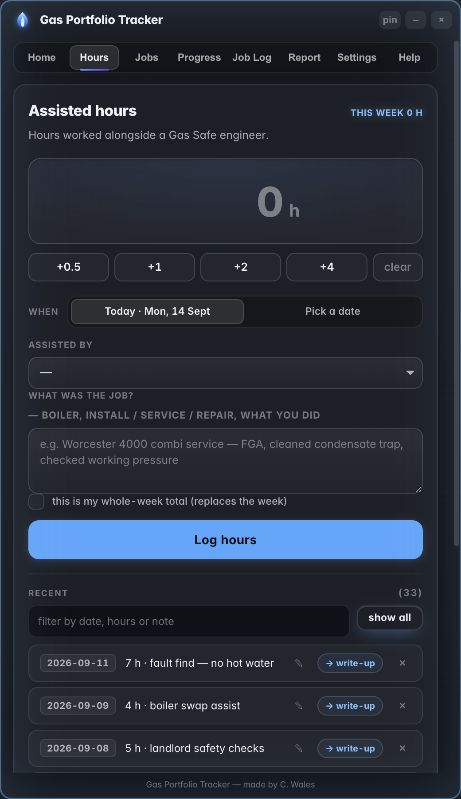
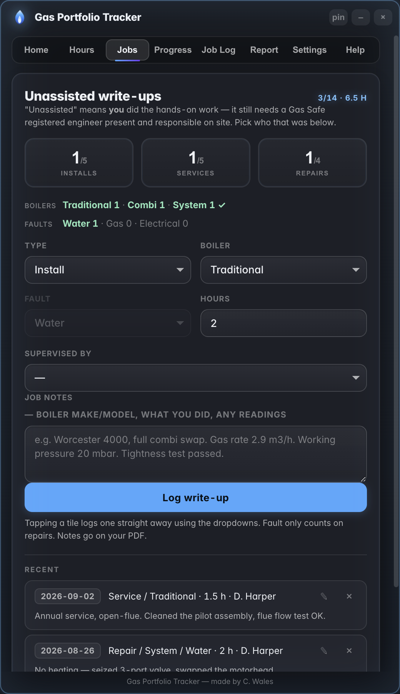
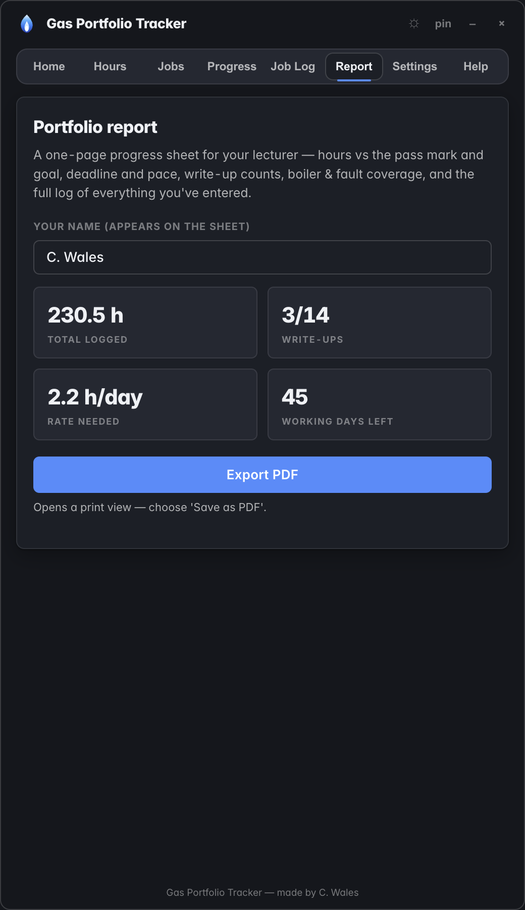
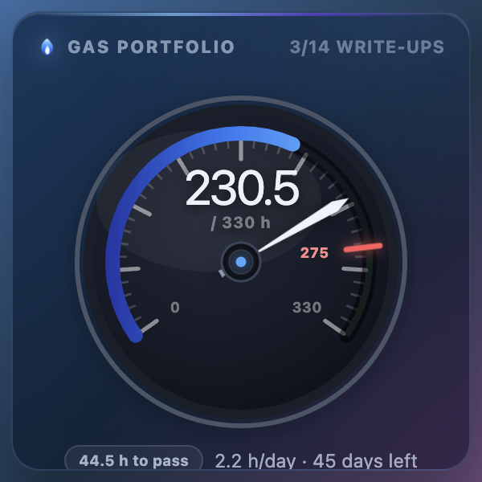

<p align="center">
  
</p>

<p align="center">
  A small desktop app for tracking a gas SVQ / NVQ portfolio —<br>
  assisted hours, unassisted write-ups, and whether you'll actually hit the deadline.
</p>

<p align="center">
  <a href="https://github.com/awpehz/gas-portfolio-tracker/releases/latest"><b>Download for macOS &amp; Windows</b></a>
  &nbsp;·&nbsp;
  <a href="https://awpehz.github.io/gas-portfolio-tracker/">Showcase</a>
</p>

<p align="center">
  
</p>

<p align="center"><i>Made by Connor W.</i></p>

---

## What it's for

Working toward a gas qualification you have to log a lot: **hours worked alongside a
Gas Safe engineer** (the pass mark is usually 275, with a personal target above that),
plus **14 unassisted "write-up" jobs** — 5 installs, 5 services, 4 repairs — that also
have to span every **boiler type** (traditional / combi / system) and every **repair
fault** (water / gas / electrical).

A spreadsheet does the storing but never answers the question that matters: **am I on
track?** This does.

The headline figure is **hours per working day needed** — your remaining hours spread
over the days you're actually available: Mon–Fri, minus college block weeks, minus
booked holidays. Comfortably under a full day means you're fine; over it and you know
now rather than in December.

Everything is stored on your machine. Nothing is uploaded.

## Screens

| Home | Hours | Jobs |
|---|---|---|
|  |  |  |

| Report — PDF for your assessor | Desktop widget |
|---|---|
|  |  |

## Features

- **Home** — progress vs the pass mark and your goal, the daily rate needed, a weekly
  aim, write-up counts with coverage, your next college block, and quick-log buttons.
- **Hours** — type the hours, pick the date, log it; or set a whole-week total. Delete
  any single entry with its own **x**.
- **Jobs** — log an unassisted write-up with its type, boiler, (for repairs) fault, and
  which Gas Safe engineer supervised it; those hours count toward your total too.
  Coverage lines light up as you hit each boiler and fault.
- **Report** — one-page PDF for your assessor, in the app's colours, with your name on
  it: hours, pace, write-up counts, boiler &amp; fault coverage, the engineers you've
  worked under, and the full log.
- **Settings** — every number is editable (starting hours, pass mark, goal, deadline,
  work-day length, job targets). College block weeks and days off are chips: add a week
  by its date, add time off as a date range, remove either with one click. Add the
  **Gas Safe engineers** you've worked under (name, registration, licence, categories,
  card expiry). Export /
  import your whole tracker as a file.
- **Desktop widget** — an optional translucent card that sits on your desktop, behind
  your windows, and stays there even when the app is closed. Total, bar and daily rate,
  updating live. It's driven from a **menu-bar icon**: open the app, log +2 h, move the
  widget between corners, start it at login. Closing the app window just tucks it away;
  the widget and menu-bar icon keep running until you Quit. Toggle with the titlebar
  button, Cmd/Ctrl + Shift + W, or the Settings tick-box.
- **In-app updates** — on launch it checks GitHub for a newer release. **Settings ->
  Check for updates -> Download & install** (or the banner button) downloads the new
  version and swaps it in on restart. No re-install, no DMG, and your logged hours and
  settings are never touched. Terminal alternative on macOS:
  ```bash
  curl -fsSL https://raw.githubusercontent.com/awpehz/gas-portfolio-tracker/main/scripts/update.sh | bash
  ```

## Install

**Download:** https://github.com/awpehz/gas-portfolio-tracker/releases/latest
(on the repo it's the **Releases** link in the sidebar; installers are under **Assets**)

### macOS
1. Download the `...-arm64.dmg`
2. Open it, drag the app into Applications
3. First launch: right-click the app -> **Open** -> **Open** (not code-signed, so
   Gatekeeper asks once)

### Windows
1. Download `...Setup...exe`
2. Run it. SmartScreen may warn ("unknown publisher") -> **More info -> Run anyway**

## Build from source

```bash
npm install
npm start            # run in dev
npm test             # logic unit tests
npm run dist:mac     # -> dist/*.dmg   (on a Mac)
npm run dist:win     # -> dist/*.exe   (on Windows)
```

`electron-builder` can't reliably cross-build a Windows installer from macOS, so the
`.exe` is produced by GitHub Actions (`.github/workflows/build.yml`). Push a tag like
`v1.2.3` and both installers appear on a new Release.

## Layout

| path | what |
|---|---|
| `src/logic.js` | the maths — pure, no DOM, unit-tested |
| `src/renderer.js` | the UI |
| `src/style.css` | the look |
| `electron/main.js` | main window, menu, data file, update check, desktop-widget window |
| `src/widget.html` / `widget.js` | the standalone desktop widget |
| `scripts/shots.js` | regenerates the screenshots in `docs/` |

MIT licensed. Bundles the **Inter** typeface under the SIL Open Font License 1.1
(`src/fonts/OFL.txt`) — the OFL expressly permits embedding and redistribution in
software.
